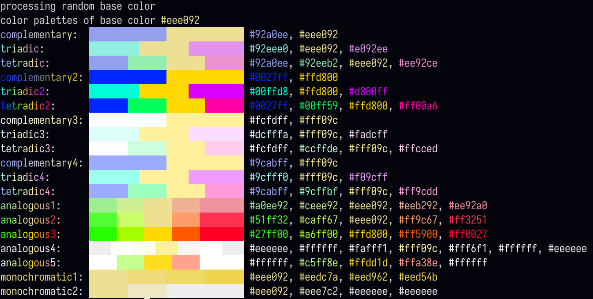

# colorpalette-gen
small cli-utility / library to generate several color variants based on any given color.

## example

# usage
simply run the jar from the releases tab. when providing no arguments, the tool will pick a random color, although there are 3 modes to pick from:
- rgb (r, g and b ranging from 0 to 255): `java -jar cpg.jar 'rgb(255, 255, 255)'`
- hex (each value represents rgb, ranging from 00 to FF): `java -jar cpg.jar 'hex(#FFFFFF)'`
- hsv (hue ranges from 0 to 360, saturation and value range from 0 to 1): `java -jar cpg.jar 'hsv(360, 1, 1)'`
